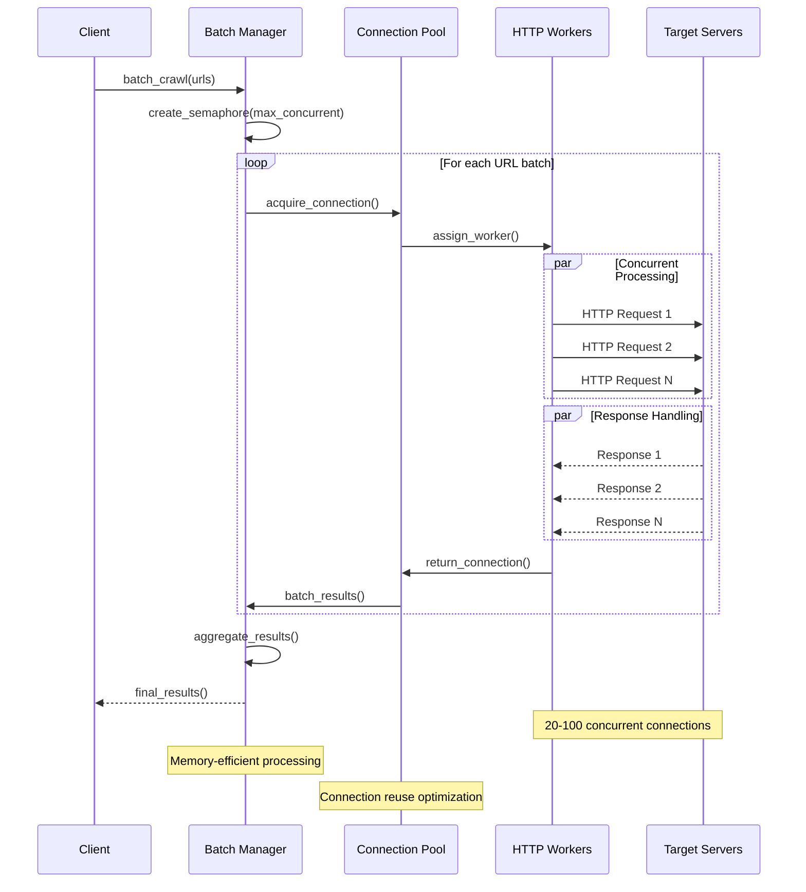
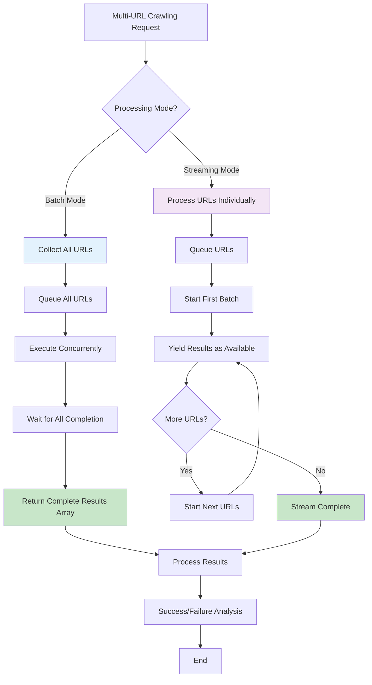

# Crawl4AI v0.7.x Documentation from Context7

**Document Purpose**: Comprehensive v0.7.x API documentation with code examples for parallel processing implementation  
**Source**: Official Crawl4AI repository via Context7  
**Date**: September 11, 2025  
**Version**: v0.7.x with native batch processing features

This document contains the latest v0.7.x API documentation with comprehensive code examples for implementing parallel processing using native Crawl4AI features.

## Key Features for Parallel Processing

### 1. Native Batch Processing with `arun_many()`

The core method for processing multiple URLs concurrently:

```python
async def arun_many(
    urls: Union[List[str], List[Any]],
    config: Optional[Union[CrawlerRunConfig, List[CrawlerRunConfig]]] = None,
    dispatcher: Optional[BaseDispatcher] = None,
    ...
) -> Union[List[CrawlResult], AsyncGenerator[CrawlResult, None]]:
    """
    Crawl multiple URLs concurrently or in batches.

    :param urls: A list of URLs (or tasks) to crawl.
    :param config: (Optional) Either:
        - A single `CrawlerRunConfig` applying to all URLs
        - A list of `CrawlerRunConfig` objects with url_matcher patterns
    :param dispatcher: (Optional) A concurrency controller (e.g. MemoryAdaptiveDispatcher).
    ...
    :return: Either a list of `CrawlResult` objects, or an async generator if streaming is enabled.
    """
```

#### Basic Batch Processing
```python
# Minimal usage: The default dispatcher will be used
results = await crawler.arun_many(
    urls=["https://site1.com", "https://site2.com"],
    config=CrawlerRunConfig(stream=False)  # Default behavior
)

for res in results:
    if res.success:
        print(res.url, "crawled OK!")
    else:
        print("Failed:", res.url, "-", res.error_message)
```

#### Streaming Mode Processing
```python
config = CrawlerRunConfig(
    stream=True,  # Enable streaming mode
    cache_mode=CacheMode.BYPASS
)

# Process results as they complete
async for result in await crawler.arun_many(
    urls=["https://site1.com", "https://site2.com", "https://site3.com"],
    config=config
):
    if result.success:
        print(f"Just completed: {result.url}")
        # Process each result immediately
        process_result(result)
```

### 2. MemoryAdaptiveDispatcher - Resource Management

Critical for large-scale parallel processing:

#### Basic Configuration
```python
from crawl4ai.async_dispatcher import MemoryAdaptiveDispatcher

dispatcher = MemoryAdaptiveDispatcher(
    memory_threshold_percent=90.0,  # Pause if memory exceeds this
    check_interval=1.0,             # How often to check memory
    max_session_permit=10,          # Maximum concurrent tasks
    rate_limiter=RateLimiter(       # Optional rate limiting
        base_delay=(1.0, 2.0),
        max_delay=30.0,
        max_retries=2
    ),
    monitor=CrawlerMonitor(         # Optional monitoring
        max_visible_rows=15,
        display_mode=DisplayMode.DETAILED
    )
)
```

#### Advanced Batch Processing with Dispatcher
```python
dispatcher = MemoryAdaptiveDispatcher(
    memory_threshold_percent=70.0,
    max_session_permit=10
)
results = await crawler.arun_many(
    urls=["https://site1.com", "https://site2.com", "https://site3.com"],
    config=my_run_config,
    dispatcher=dispatcher
)
```

### 3. Complete Batch Processing Example

```python
async def crawl_batch():
    browser_config = BrowserConfig(headless=True, verbose=False)
    run_config = CrawlerRunConfig(
        cache_mode=CacheMode.BYPASS,
        stream=False  # Default: get all results at once
    )
    
    dispatcher = MemoryAdaptiveDispatcher(
        memory_threshold_percent=70.0,
        check_interval=1.0,
        max_session_permit=10,
        monitor=CrawlerMonitor(
            display_mode=DisplayMode.DETAILED
        )
    )

    async with AsyncWebCrawler(config=browser_config) as crawler:
        # Get all results at once
        results = await crawler.arun_many(
            urls=urls,
            config=run_config,
            dispatcher=dispatcher
        )
        
        # Process all results after completion
        for result in results:
            if result.success:
                await process_result(result)
            else:
                print(f"Failed to crawl {result.url}: {result.error_message}")
```

### 4. Complete Streaming Processing Example

```python
async def crawl_streaming():
    browser_config = BrowserConfig(headless=True, verbose=False)
    run_config = CrawlerRunConfig(
        cache_mode=CacheMode.BYPASS,
        stream=True  # Enable streaming mode
    )
    
    dispatcher = MemoryAdaptiveDispatcher(
        memory_threshold_percent=70.0,
        check_interval=1.0,
        max_session_permit=10,
        monitor=CrawlerMonitor(
            display_mode=DisplayMode.DETAILED
        )
    )

    async with AsyncWebCrawler(config=browser_config) as crawler:
        # Process results as they become available
        async for result in await crawler.arun_many(
            urls=urls,
            config=run_config,
            dispatcher=dispatcher
        ):
            if result.success:
                # Process each result immediately
                await process_result(result)
            else:
                print(f"Failed to crawl {result.url}: {result.error_message}")
```

## True Concurrency in v0.7.4+

Major performance improvement in v0.7.4:

```python
# Before v0.7.4: Sequential-like behavior for fast tasks
# After v0.7.4: True concurrency

async with AsyncWebCrawler() as crawler:
    # These will now run with true concurrency
    urls = [
        "https://httpbin.org/delay/1",
        "https://httpbin.org/delay/1", 
        "https://httpbin.org/delay/1",
        "https://httpbin.org/delay/1"
    ]
    
    # Processes in truly parallel fashion
    results = await crawler.arun_many(urls)
    
    # Performance improvement: ~4x faster for fast-completing tasks
    print(f"Processed {len(results)} URLs with true concurrency")
```

## URL-Specific Configurations

Apply different configurations based on URL patterns:

```python
from crawl4ai import AsyncWebCrawler, CrawlerRunConfig, MatchMode
from crawl4ai.processors.pdf import PDFContentScrapingStrategy
from crawl4ai.extraction_strategy import JsonCssExtractionStrategy
from crawl4ai.content_filter_strategy import PruningContentFilter
from crawl4ai.markdown_generation_strategy import DefaultMarkdownGenerator

async def crawl_mixed_content():
    # Configure different strategies for different content
    configs = [
        # PDF files - specialized extraction
        CrawlerRunConfig(
            url_matcher="*.pdf",
            scraping_strategy=PDFContentScrapingStrategy()
        ),
        
        # Blog/article pages - content filtering
        CrawlerRunConfig(
            url_matcher=["*/blog/*", "*/article/*"],
            markdown_generator=DefaultMarkdownGenerator(
                content_filter=PruningContentFilter(threshold=0.48)
            )
        ),
        
        # Dynamic pages - JavaScript execution
        CrawlerRunConfig(
            url_matcher=lambda url: 'github.com' in url,
            js_code="window.scrollTo(0, 500);"
        ),
        
        # API endpoints - JSON extraction
        CrawlerRunConfig(
            url_matcher=lambda url: 'api' in url or url.endswith('.json'),
            # Custom settings for JSON extraction
        ),
        
        # Default config for everything else
        CrawlerRunConfig()  # No url_matcher means it matches ALL URLs (fallback)
    ]
    
    # Mixed URLs
    urls = [
        "https://www.w3.org/WAI/ER/tests/xhtml/testfiles/resources/pdf/dummy.pdf",
        "https://blog.python.org/",
        "https://github.com/microsoft/playwright",
        "https://httpbin.org/json",
        "https://example.com/"
    ]
    
    async with AsyncWebCrawler() as crawler:
        results = await crawler.arun_many(
            urls=urls,
            config=configs  # Pass list of configs
        )
        
        for result in results:
            print(f"{result.url}: {len(result.markdown)} chars")
```

## Quick Parallel Processing Example

```python
import asyncio
from crawl4ai import AsyncWebCrawler, CrawlerRunConfig, CacheMode

async def quick_parallel_example():
    urls = [
        "https://example.com/page1",
        "https://example.com/page2",
        "https://example.com/page3"
    ]
    
    run_conf = CrawlerRunConfig(
        cache_mode=CacheMode.BYPASS,
        stream=True  # Enable streaming mode
    )

    async with AsyncWebCrawler() as crawler:
        # Stream results as they complete
        async for result in await crawler.arun_many(urls, config=run_conf):
            if result.success:
                print(f"[OK] {result.url}, length: {len(result.markdown.raw_markdown)}")
            else:
                print(f"[ERROR] {result.url} => {result.error_message}")

        # Or get all results at once (default behavior)
        run_conf = run_conf.clone(stream=False)
        results = await crawler.arun_many(urls, config=run_conf)
        for res in results:
            if res.success:
                print(f"[OK] {res.url}, length: {len(res.markdown.raw_markdown)}")
            else:
                print(f"[ERROR] {res.url} => {res.error_message}")

if __name__ == "__main__":
    asyncio.run(quick_parallel_example())
```

## Memory Monitoring and Management

Enhanced memory utilities in v0.7.4:

```python
# All memory utilities now consolidated
from crawl4ai.utils import get_true_memory_usage_percent, MemoryMonitor

# Enhanced memory monitoring
monitor = MemoryMonitor()
monitor.start_monitoring()

async with AsyncWebCrawler() as crawler:
    # Memory-efficient batch processing
    results = await crawler.arun_many(large_url_list)
    
    # Get accurate memory metrics
    memory_usage = get_true_memory_usage_percent()
    memory_report = monitor.get_report()
    
    print(f"Memory efficiency: {memory_report['efficiency']:.1f}%")
    print(f"Peak usage: {memory_report['peak_mb']:.1f} MB")
```

## Batch Processing Architecture



## Streaming vs Batch Processing Flow



## Performance Characteristics

Based on v0.7.x capabilities:

### **Memory Management**
- **Adaptive Thresholds**: 70-90% memory threshold monitoring
- **Session Limits**: Max 10+ concurrent browser sessions
- **Resource Monitoring**: Real-time system stats tracking

### **True Concurrency (v0.7.4+)**
- **Before v0.7.4**: Sequential-like behavior for fast tasks
- **After v0.7.4**: True parallel processing
- **Performance**: ~4x faster for fast-completing tasks

### **Connection Management**
- **Native arun_many()**: Built-in concurrent processing
- **Memory Adaptive**: Automatic resource management
- **Rate Limiting**: Built-in delay calculation and backoff

## Implementation Best Practices

1. **Use native `arun_many()`** instead of custom batch processing
2. **Implement MemoryAdaptiveDispatcher** for production workloads
3. **Choose appropriate streaming vs batch mode** based on use case
4. **Configure memory thresholds** based on system resources
5. **Use URL-specific configurations** for different content types
6. **Monitor performance metrics** for optimization

---

**References**:
- Official Crawl4AI Repository: https://github.com/unclecode/crawl4ai
- Documentation retrieved via Context7 on September 11, 2025  
- Version: v0.7.x with native batch processing features
- Trust Score: 9.9/10 with comprehensive code examples